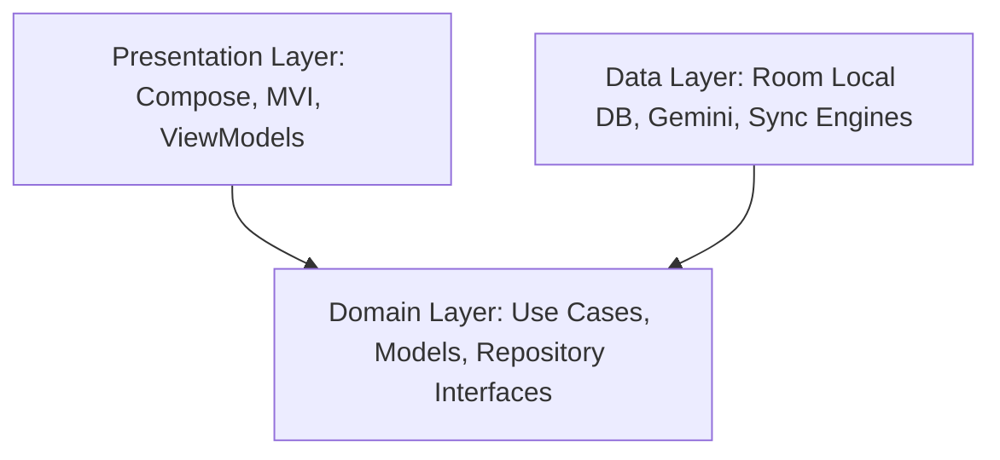

<div align="center">

</div>

# SoulJournal (Ethereal Journal)

SoulJournal is a premium, AI-powered native Android journaling application that seamlessly blends offline-first reliability with advanced generative capabilities. Evolved from an initial Google AI Studio prototype, this application leverages Gemini 1.5 Flash to provide intelligent summaries, thematic insights, and dynamic mood tracking.

## ✨ Key Features

- **Generative AI Confidant**: Uses Gemini 1.5 Flash to analyze journal entries, identify milestones, extract emotional insights, and offer actionable suggestions in real-time.
- **Offline-First Synchronization**: Fully functional without network connectivity. Local Room databases sync seamlessly with the cloud using a Last-Write-Wins (LWW) conflict resolution engine orchestrated by WorkManager.
- **Multi-Modal Ingestion**: Support for standard text entry alongside advanced voice dictation (SpeechRecognizer) and Camera OCR integrations (ML Kit).
- **Responsive Material Design 3**: A modern, fluid user interface driven by Jetpack Compose. Includes custom tab layouts, bottom sheet settings, interactive weekly carousels, and premium aesthetic themes (Rose, Indigo, Slate).
- **Identity & Security**: Secure credential management powered by Android's Credential Manager and mocked Google Cloud Ingress routing.

---

## 🏗️ Architecture

This project strictly adheres to **Clean Architecture** principles to separate concerns, facilitate testing, and enforce a scalable unidirectional data flow using the **MVI (Model-View-Intent)** presentation pattern.

### The Layers



#### 1. Presentation Layer (`com.diary.ai.presentation`)
Handles all UI rendering and user interactions using **Jetpack Compose** and **MVI**.
- **Unidirectional Data Flow**: User actions are transformed into discrete intents (e.g., `DiaryUserIntent.RequestDailySummary`). The `DiaryViewModel` processes these intents and emits a single, immutable `DiaryViewState` back to the UI.
- **Components**: `DashboardScreen`, `OnboardingScreen`, and custom composable widgets (e.g., `WeeklyCalendarCarousel`).
- **Ingestion Tools**: Features like the `VoiceDictationEngine` and `TextRecognitionAnalyzer` exist here to capture user inputs before passing them to the domain layer.

#### 2. Domain Layer (`com.diary.ai.domain`)
The core of the application containing all atomic business logic and models. It is completely isolated from Android framework dependencies (except for basic coroutines/flows).
- **Models**: Plain Kotlin data classes like `Note`, `SyncStatus`, and `AISummary`.
- **Use Cases**: Encapsulate single responsibilities (e.g., `GetNotesByDateUseCase`, `SaveNoteUseCase`, `GenerateDailySummaryUseCase`).
- **Repository Interfaces**: Define the contracts for data access (`DiaryRepository`, `CloudRepository`, `SyncScheduler`).

#### 3. Data Layer (`com.diary.ai.data`)
Implements the interfaces defined by the Domain layer and handles all external data sources.
- **Local Persistence (`Room`)**: `NoteDatabase` and `NoteDao` manage offline SQLite storage.
- **Sync & Replication Engine**: `SyncWorker` executes via Android `WorkManager` with network-connected constraints, applying LWW conflict reconciliation against remote data.
- **Cognitive AI**: `GeminiClient` interfaces directly with `gemini-1.5-flash` using structured JSON schema instructions to ensure deterministic and type-safe AI responses.

---

## 🛠️ Technology Stack & Libraries

The application uses modern, declarative Android development tools and libraries:

### Core & Architecture
- **Kotlin** (1.9.0+)
- **Coroutines & StateFlow**: For asynchronous operations and reactive state management.
- **Hilt / Dagger** (Optional/Manual DI): For dependency injection.

### Presentation
- **Jetpack Compose**: The modern declarative UI toolkit.
  - `androidx.compose.ui:ui`
  - `androidx.compose.material3:material3`
  - `androidx.compose.material:material-icons-extended`
- **Coil Compose**: For asynchronous image loading from network CDNs.

### Data & Persistence
- **Room**: Abstraction layer over SQLite for robust local database access.
- **WorkManager**: For scheduling reliable, asynchronous background sync tasks.
- **Google AI Client SDK (`com.google.ai.client.generativeai`)**: Interfaces with Gemini 1.5 Flash.

### Additional Integrations
- **Credential Manager**: Modern identity and authentication flows.
- **Google ML Kit Text Recognition**: For on-device OCR from camera inputs.

---

## 🚀 Setup & Installation

### Prerequisites
- **Android Studio Jellyfish (or newer)**
- **JDK 17** (Amazon Corretto or equivalent)
- **Android SDK 34 (UpsideDownCake)**

### Build Instructions

1. **Clone the Repository**
   ```bash
   git clone <repository_url>
   cd Ethereal-Journal
   ```

2. **Configure API Keys**
   To enable AI features, you must supply a Gemini API Key.
   Create a `local.properties` file in the root of the project (if it doesn't exist) and add your key:
   ```properties
   GEMINI_API_KEY="your_api_key_here"
   ```

3. **Build the Project**
   Open the project in Android Studio, or build via Gradle from the command line:
   ```bash
   ./gradlew compileDebugKotlin
   ```

4. **Run Unit Tests**
   Validate the offline-first LWW replication strategy and Gemini parser schemas:
   ```bash
   ./gradlew testDebugUnitTest
   ```

5. **Deploy to Device / Emulator**
   Press **Run** in Android Studio or use the command line:
   ```bash
   ./gradlew installDebug
   ```

---

## 🤝 Contributing
Follow the standard fork-and-pull-request workflow. Ensure that any new domain logic is accompanied by appropriate Use Cases and tested thoroughly against the `SyncResolutionTest` suites.

## 📄 License
Copyright (c) 2026. All rights reserved.